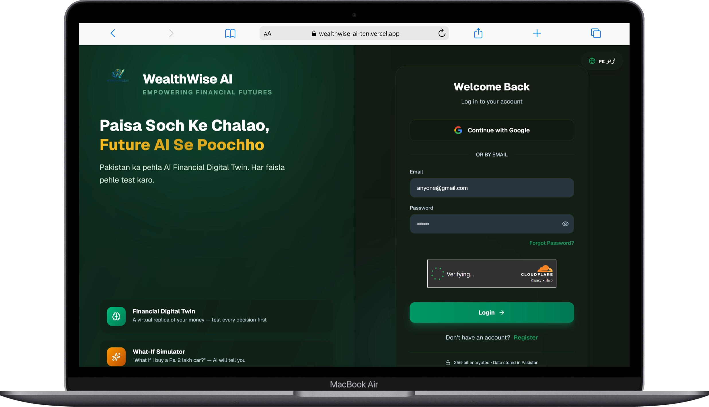
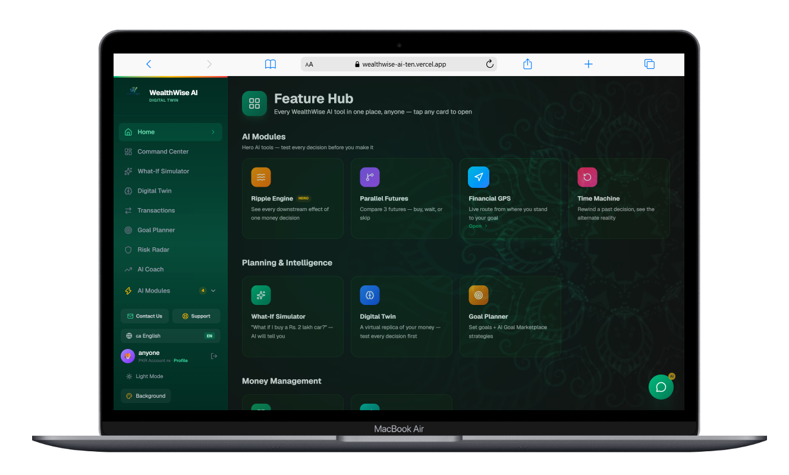
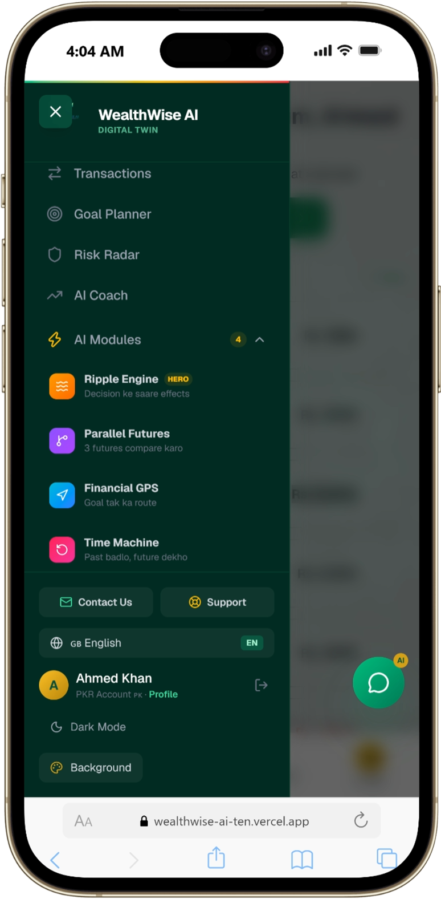
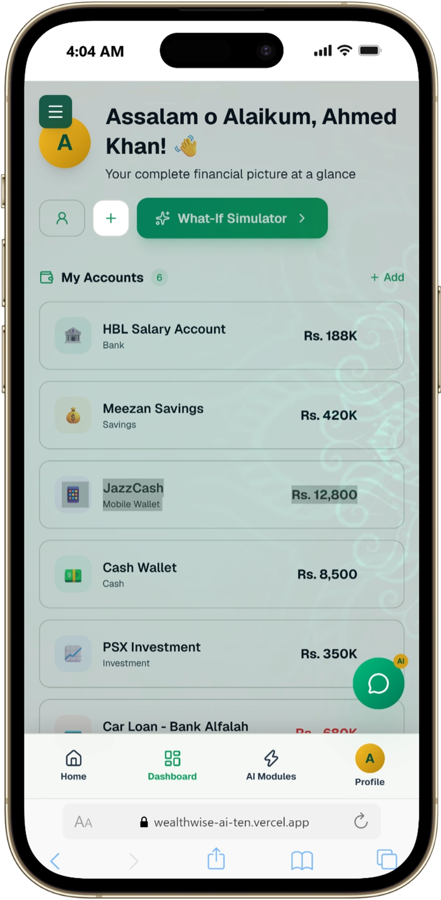

<div align="center">

# 💰 WealthWise AI

### *Apne Paise Ka Bhavishya Pehle Se Dekho*

**Pakistan's First AI-Powered Financial Digital Twin**

[🌐 Live Demo](https://wealthwise-ai-ten.vercel.app) · [📄 Documentation](#-documentation) · [🚀 Get Started](#-quick-start)


</div>

---

## 📖 About

WealthWise AI is a next-generation financial platform that creates a **virtual replica (Digital Twin)** of your complete financial life. Instead of just tracking past expenses, it uses **Google Gemini AI** to simulate future outcomes — so you can test every money decision before making it.

Built specifically for the **Pakistani market** — supporting PKR currency, local banks (HBL, UBL, Meezan, EasyPaisa, JazzCash), and full **English + Urdu** bilingual interface.

---

## 🖥️ Screenshots

### Desktop

<p align="center">
  
  <em>Login Page — Dark theme with Aurora background</em>
</p>

<p align="center">
  
  <em>Feature Hub — All AI Modules at a glance</em>
</p>

### Mobile

<p align="center">
  
  &nbsp;&nbsp;&nbsp;&nbsp;
  
</p>

---

## ✨ Key Features

| Feature | Description |
|---------|-------------|
| 🧬 **Financial Digital Twin** | Virtual replica of your money — test every decision first |
| 🌊 **Ripple Engine** | See every downstream effect of one money decision |
| 🔀 **Parallel Futures** | Compare 3 futures — buy, wait, or skip |
| 🧭 **Financial GPS** | Live route from where you stand to your goal |
| ⏪ **Time Machine** | Rewind a past decision, see the alternate reality |
| 📊 **What-If Simulator** | "What if I buy a Rs. 2 lakh car?" — AI will tell you |
| 🛡️ **Stress Test** | Salary delay, job loss, emergency — plan every scenario |
| 🤖 **AI Coach (Streaming)** | Real AI that gives advice on your actual data — English or Urdu |
| 📄 **Bank Statement AI** | Upload PDF/CSV — AI extracts & categorizes all transactions |
| 🎯 **Goals Tracker** | Set goals with AI feasibility analysis |

---

## 🛠️ Tech Stack

| Layer | Technology |
|-------|-----------|
| **Frontend** | Next.js 16.3.3, React 19, TypeScript 5, Tailwind CSS 4 |
| **UI** | Framer Motion, Recharts, Lucide Icons, next-themes |
| **Backend** | Next.js API Routes (20 endpoints), Serverless Functions |
| **Database** | Turso (libSQL Cloud), better-sqlite3 (local dev) |
| **AI** | Google Gemini (gemini-3.8-flash + gemini-3.5-flash-lite fallback) |
| **Auth** | Supabase OAuth (Google), JWT, bcrypt, OTP, Cloudflare Turnstile |
| **Deployment** | Vercel (Serverless + Edge CDN) |

---

## 🚀 Quick Start

### Prerequisites

- **Node.js** 18+ ([Download](https://nodejs.org))
- **npm** or **yarn**

### 1. Clone the Repository

```bash
git clone https://github.com/AZANAMIR272/wealthwise-ai.git
cd wealthwise-ai
```

### 2. Install Dependencies

```bash
npm install
```

### 3. Configure Environment Variables

Copy the example file:

```bash
cp .env.example .env.local
```

Then edit `.env.local` and fill in your values:

| Variable | Where to Get It |
|----------|----------------|
| `NEXT_PUBLIC_SUPABASE_URL` | [Supabase Dashboard](https://supabase.com/dashboard) → Project Settings → API |
| `NEXT_PUBLIC_SUPABASE_ANON_KEY` | Same as above |
| `GEMINI_API_KEY` | [Google AI Studio](https://aistudio.google.com/apikey) |
| `TURSO_DATABASE_URL` | [Turso](https://turso.tech) → Create Database → Credentials |
| `TURSO_AUTH_TOKEN` | Same as above |
| `JWT_SECRET` | Any strong random string (min 32 chars) |
| `NEXT_PUBLIC_TURNSTILE_SITE_KEY` | [Cloudflare Dashboard](https://dash.cloudflare.com) → Turnstile |
| `TURNSTILE_SECRET_KEY` | Same as above |
| `ADMIN_EMAIL` | Your admin email |
| `ADMIN_PASSWORD` | Your admin password |

### 4. Run Development Server

```bash
npm run dev
```

Open [http://localhost:3000](http://localhost:3000) in your browser.

### 5. Build for Production

```bash
npm run build
npm start
```

---

## 📁 Project Structure

```
wealthwise-ai/
├── src/
│   ├── app/                    # Pages & API Routes
│   │   ├── page.tsx            # Login / Register page
│   │   ├── home/               # Feature Hub (after login)
│   │   ├── dashboard/          # Financial Dashboard
│   │   ├── coach/              # AI Coach page
│   │   ├── ripple/             # Ripple Engine
│   │   ├── parallel/           # Parallel Futures
│   │   ├── gps/                # Financial GPS
│   │   ├── time-machine/       # Time Machine
│   │   ├── simulator/          # What-If Simulator
│   │   ├── digital-twin/       # Financial Digital Twin
│   │   ├── goals/              # Goals Tracker
│   │   ├── risk/               # Risk Radar
│   │   ├── transactions/       # Transaction Manager
│   │   ├── admin/              # Admin Panel
│   │   └── api/                # 20 API Route Handlers
│   │       ├── auth/           # Login, Register, Google OAuth, OTP
│   │       ├── ai/             # Chat (streaming), Analyze, Statement
│   │       ├── accounts/       # CRUD accounts
│   │       ├── transactions/   # CRUD transactions
│   │       ├── financial/      # Financial snapshot
│   │       ├── goals/          # CRUD goals
│   │       ├── profile/        # User profile
│   │       └── admin/          # Admin endpoints
│   ├── components/             # 15 React Components
│   │   ├── sidebar.tsx         # Desktop navigation
│   │   ├── bottom-nav.tsx      # Mobile navigation
│   │   ├── floating-chat.tsx   # AI Coach streaming chat
│   │   ├── turnstile.tsx       # Cloudflare CAPTCHA
│   │   └── ...
│   └── lib/                    # Core Logic
│       ├── financial-engine.ts # 1200+ lines of financial calculations
│       ├── ai-service.ts       # Gemini AI integration
│       ├── gemini-client.ts    # Model fallback + streaming
│       ├── auth.ts             # JWT, bcrypt, OTP
│       ├── db.ts               # Turso/libSQL database
│       ├── i18n.ts             # English/Urdu translations
│       └── supabase.ts         # Supabase OAuth client
├── public/                     # Static assets
│   ├── backgrounds/            # Cultural mandala patterns
│   ├── team/                   # Team member photos
│   └── logo.*                  # App logos
├── .env.example                # Environment variables template
└── package.json
```

---

## 🔐 Authentication Flow

```
Register → OTP Verification → Login → JWT Cookie (7 days)
     │
     ├── Email + Password (bcrypt hashed)
     ├── Google OAuth (via Supabase)
     └── Demo Mode (instant access)

Security: Cloudflare Turnstile CAPTCHA on all auth forms
```

---

## 🤖 AI Architecture

```
User Question → Build Financial Context (real data)
                     │
              ┌──────▼──────┐
              │ gemini-3.8- │ ← Primary (fastest)
              │   flash     │
              └──────┬──────┘
                     │ 503? Fallback
              ┌──────▼──────┐
              │ gemini-3.5- │ ← Fallback (cheapest)
              │  flash-lite │
              └──────┬──────┘
                     │
              Stream Response → Real-time typewriter UI
```

---

## 📄 Documentation

Full project documentation is available in the `WealthWise_AI_Full_Documentation.docx` file, covering:

- Complete architecture & system design
- Database schema (all tables)
- API endpoints reference (26 routes)
- AI integration details
- Security & authentication flow
- UI/UX design system
- Deployment & infrastructure

---

## 🌐 Live Demo

👉 **[https://wealthwise-ai-ten.vercel.app](https://wealthwise-ai-ten.vercel.app)**

Click **"Demo for Guide"** on the login page to explore with sample data.

---

## 👥 Team

| Name | Role |
|------|------|
| **Syed Muhammad Azan** | Lead Developer & Architect |
| **Isbah Ali** | UI/UX Designer & Data Analyst |
| **Mariam Zuberi** | Frontend Developer |
| **Muhammad Safwan** | Backend Developer |

---

## 📄 License

This project is developed as a *ALIBABA AI HACKATHON**.

---

<div align="center">

**Made with ❤️ in Pakistan**

[⬆ Back to Top](#-wealthwise-ai)

</div>
